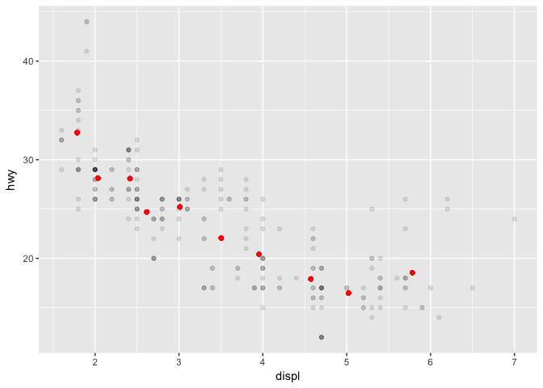
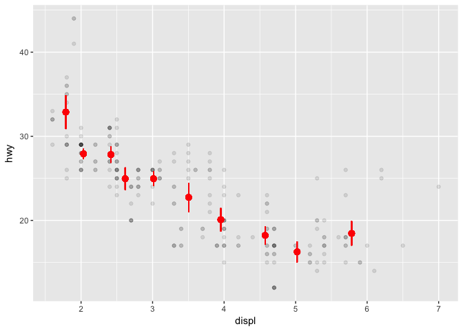
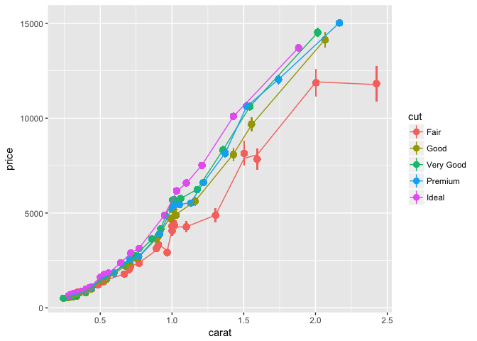

stat\_binscatter
================
Maximilian Eber
26/09/2017

The binscatter is a summary tool for large datasets. It can be interpreted as an empirical approximation of the conditional expectation function *E*\[*y*|*x*\]. This is particularly helpful when dealing with large datasets since scatterplots often become messy when N grows large.

The difference to `stat_bin` is that the bins are not of equal width but of equal size. Keeping the number of observations (roughly) constant across bins helps identify areas of high density in the data. Therefore, the method avoids overinterpreting thinly populated cells with noisy means.

``` r
library(ggplot2)
source("stat_binscatter.R")
```

Examples
--------

``` r
ggplot(mpg, aes(x = displ, y = hwy)) +
  geom_point(alpha = .1) +
  stat_binscatter(color = "red")
```



You can add approximate standard errors by changing the geom to `pointrange`:

``` r
ggplot(mpg, aes(x = displ, y = hwy)) + 
  geom_point(alpha = .1) + 
  stat_binscatter(color = "red", geom = "pointrange")
```



Binscattering works well on large datasets where a scatterplot might be confusing (and take a long time to plot):

``` r
ggplot(diamonds, aes(x = carat, y = price, color = cut)) + 
  stat_binscatter(bins = 20, geom = "pointrange") +
  stat_binscatter(bins = 20, geom = "line")
```


